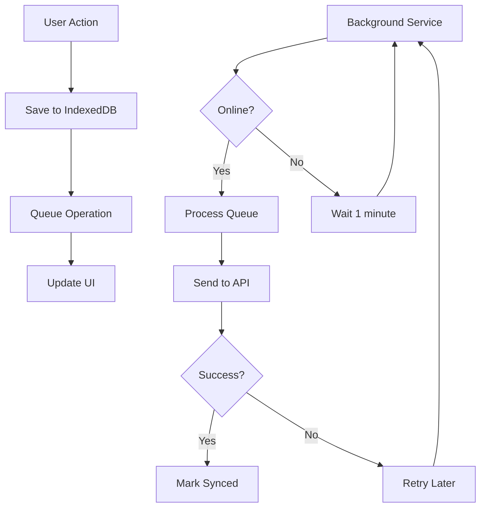

# Deployment & Setup Guide

## 🚀 Quick Setup for New Developers

### Prerequisites
- **Node.js 18+** (LTS recommended)
- **npm 9+** or **yarn 1.22+**
- **Git** for version control
- **VS Code** (recommended) with extensions:
  - TypeScript and JavaScript Language Features
  - Tailwind CSS IntelliSense
  - ES7+ React/Redux/React-Native snippets

### Local Development Setup

1. **Clone Repository**
```bash
git clone <repository-url>
cd sadiid-offline-pos
```

2. **Install Dependencies**
```bash
npm install
# or
yarn install
```

3. **Environment Configuration**
Create `.env` file:
```env
VITE_API_BASE_URL=https://erp.sadiid.net
VITE_APP_NAME=Sadiid POS
VITE_APP_VERSION=1.0.0
```

4. **Start Development Server**
```bash
npm run dev
# or
yarn dev
```

5. **Open Application**
- Navigate to `http://localhost:5173`
- Default login credentials (if using test environment):
  - Username: `demo@sadiid.net`
  - Password: `demo123`

### First-Time Developer Checklist

- [ ] Application loads without errors
- [ ] Can login successfully
- [ ] IndexedDB is working (check Browser DevTools > Application > Storage)
- [ ] POS functionality works offline
- [ ] Background sync processes after going online
- [ ] PWA installation prompt appears

## 📁 Project Structure Deep Dive

### Core Directories

```
sadiid-offline-pos/
├── public/                 # Static assets
│   ├── pwa-192x192.png    # PWA icons
│   ├── pwa-512x512.png
│   └── robots.txt
├── src/
│   ├── components/        # React components
│   ├── context/          # React Context providers
│   ├── hooks/           # Custom React hooks
│   ├── lib/             # Core utilities
│   ├── pages/           # Route components
│   ├── services/        # External services
│   ├── types/           # TypeScript definitions
│   └── utils/           # Helper functions
├── docs/                # Documentation (this folder)
├── .env                 # Environment variables
├── package.json         # Dependencies and scripts
├── tailwind.config.ts   # Tailwind configuration
├── tsconfig.json        # TypeScript configuration
└── vite.config.ts       # Vite build configuration
```

### Key Configuration Files

#### `package.json` Scripts
```json
{
  "scripts": {
    "dev": "vite",                    // Development server
    "build": "tsc && vite build",     // Production build
    "preview": "vite preview",        // Preview production build
    "lint": "eslint src --ext ts,tsx", // Code linting
    "type-check": "tsc --noEmit"      // TypeScript type checking
  }
}
```

#### `vite.config.ts` Key Features
- PWA configuration with service worker
- Path aliases (`@/` for `src/`)
- Development server proxy for API calls
- Build optimizations for production

#### `tailwind.config.ts` Customizations
- Custom color scheme for Sadiid branding
- Component-specific styling
- Responsive breakpoints
- Dark mode support (if enabled)

## 🗄️ Database Schema & Storage

### IndexedDB Stores

The application uses several IndexedDB stores for offline functionality:

#### 1. Products Store
```typescript
{
  keyPath: 'id',
  indexes: {
    'by-name': 'name',
    'by-category': 'category.id'
  }
}
```

#### 2. Contacts Store
```typescript
{
  keyPath: 'id',
  indexes: {
    'by-name': 'name'
  }
}
```

#### 3. Sales Store
```typescript
{
  keyPath: 'local_id',
  autoIncrement: true,
  indexes: {
    'by-date': 'transaction_date',
    'by-sync': 'is_synced'
  }
}
```

#### 4. Sync Queue Store
```typescript
{
  keyPath: 'id',
  indexes: {
    'by-status': 'status',
    'by-type': 'type',
    'by-created': 'createdAt'
  }
}
```

### Data Initialization

On first app load:
1. IndexedDB databases are created
2. Business settings are fetched and cached
3. Products and customers are synchronized
4. User authentication state is restored

## 🔄 Sync System Architecture

### Background Sync Flow



### Sync Triggers

1. **Automatic**: Every 1 minute when online
2. **Network Events**: When connection is restored
3. **App Startup**: Initial sync on login
4. **Manual**: User-triggered sync buttons

### Retry Logic

Failed operations use exponential backoff:
- Attempt 1: Immediate
- Attempt 2: 1 second delay
- Attempt 3: 2 second delay
- Attempt 4: 4 second delay
- Attempt 5: 8 second delay (max)

## 🌐 Network & Offline Handling

### Network Detection

The app monitors network status using:
- `navigator.onLine` for basic connectivity
- Regular server ping tests for actual reachability
- Connection quality assessment

### Offline Capabilities

When offline, users can:
- Browse complete product catalog
- Create and manage sales transactions
- Add and edit customer information
- View sales history and reports
- Generate local receipts

### Data Persistence

All user data is preserved across:
- Browser refreshes
- App restarts
- Network disconnections
- Device reboots (via IndexedDB)

## 🎨 UI/UX Development

### Component Architecture

```
components/
├── ui/                   # Base components (shadcn/ui)
│   ├── button.tsx
│   ├── card.tsx
│   ├── table.tsx
│   └── ...
├── pos/                  # POS-specific components
│   ├── POSProductGrid.tsx
│   ├── POSOrderDetails.tsx
│   └── POSCategoryFilters.tsx
├── layouts/              # Layout components
│   ├── Header.tsx
│   ├── Sidebar.tsx
│   └── ProtectedLayout.tsx
└── ...
```

### Styling Guidelines

#### Color Scheme
```css
:root {
  --color-primary: #2563eb;      /* Blue */
  --color-secondary: #10b981;    /* Green */
  --color-accent: #f59e0b;       /* Amber */
  --color-danger: #ef4444;       /* Red */
}
```

#### Responsive Breakpoints
```css
/* Tailwind CSS breakpoints */
sm: 640px   /* Mobile landscape */
md: 768px   /* Tablet */
lg: 1024px  /* Desktop */
xl: 1280px  /* Large desktop */
```

#### Typography
- **Headings**: Inter font family
- **Body**: System font stack
- **Code**: JetBrains Mono

### Accessibility

- Semantic HTML structure
- ARIA labels for interactive elements
- Keyboard navigation support
- Screen reader compatibility
- Color contrast compliance (WCAG 2.1)

## 🔒 Security & Authentication

### OAuth 2.0 Flow

1. **Login**: User credentials → Bearer token
2. **Storage**: Token stored in localStorage
3. **API Calls**: Token included in Authorization header
4. **Refresh**: Automatic token refresh on expiry
5. **Logout**: Token removal and cleanup

### Security Best Practices

- Tokens are validated on each API request
- Sensitive data is not logged to console in production
- HTTPS is enforced for all API communications
- XSS protection via Content Security Policy
- Input validation on all user inputs

## 🧪 Testing & Quality Assurance

### Manual Testing Checklist

#### Offline Functionality
- [ ] Create sale while offline
- [ ] Add customer while offline
- [ ] Browse products while offline
- [ ] Verify data persists after browser refresh
- [ ] Test sync when coming back online

#### Cross-Browser Testing
- [ ] Chrome (latest)
- [ ] Firefox (latest)
- [ ] Safari (latest)
- [ ] Edge (latest)
- [ ] Mobile browsers (iOS Safari, Chrome Mobile)

#### Performance Testing
- [ ] Initial page load < 3 seconds
- [ ] Product search response < 500ms
- [ ] Sale creation < 1 second
- [ ] IndexedDB operations < 100ms
- [ ] Memory usage stable over time

### Debugging Tools

#### Browser DevTools
- **Application Tab**: IndexedDB inspection
- **Network Tab**: API call monitoring
- **Console**: Error logging and debugging
- **Performance Tab**: Performance profiling

#### Useful Console Commands
```javascript
// Check IndexedDB contents
await window.indexedDB.databases()

// Inspect sync queue
import { getQueueStats } from '@/services/syncQueue'
await getQueueStats()

// Force sync
import { processQueue } from '@/services/syncQueue'
await processQueue()
```

## 🚀 Production Deployment

### Build Process

1. **Type Check**
```bash
npm run type-check
```

2. **Lint Code**
```bash
npm run lint
```

3. **Build for Production**
```bash
npm run build
```

4. **Preview Build**
```bash
npm run preview
```

### Build Output

```
dist/
├── assets/              # Compiled JS/CSS files
├── index.html          # Main HTML file
├── manifest.json       # PWA manifest
└── sw.js              # Service worker
```

### Deployment Options

#### Static Hosting (Recommended)
- **Netlify**: Automatic deploys from Git
- **Vercel**: Zero-config deployments
- **GitHub Pages**: Free hosting for public repos
- **AWS S3 + CloudFront**: Scalable solution

#### Server Deployment
- **Nginx**: Serve static files with proper headers
- **Apache**: Configure for SPA routing
- **Node.js**: Use express.static for file serving

### Environment-Specific Configurations

#### Production Environment Variables
```env
VITE_API_BASE_URL=https://erp.sadiid.net
VITE_APP_NAME=Sadiid POS
VITE_APP_VERSION=1.0.0
VITE_BUILD_ENV=production
```

#### Staging Environment Variables
```env
VITE_API_BASE_URL=https://staging.erp.sadiid.net
VITE_APP_NAME=Sadiid POS (Staging)
VITE_APP_VERSION=1.0.0-staging
VITE_BUILD_ENV=staging
```

### Performance Optimizations

#### Bundle Analysis
```bash
npm run build -- --analyze
```

#### Optimization Checklist
- [ ] Tree shaking enabled
- [ ] Code splitting implemented
- [ ] Images optimized and compressed
- [ ] Service worker caching configured
- [ ] Gzip compression enabled
- [ ] CDN configured for assets

## 🔧 Troubleshooting

### Common Issues

#### Issue: Build Fails with TypeScript Errors
**Solution**: 
1. Run `npm run type-check` to identify issues
2. Fix type errors in source code
3. Ensure all imports use correct paths

#### Issue: IndexedDB Not Working
**Solution**:
1. Check browser compatibility (95%+ support)
2. Verify user hasn't disabled storage
3. Check for quota exceeded errors
4. Clear browser data and retry

#### Issue: Sync Not Working
**Solution**:
1. Check network connectivity
2. Verify API endpoint accessibility
3. Check authentication token validity
4. Inspect sync queue in IndexedDB

#### Issue: PWA Not Installing
**Solution**:
1. Verify HTTPS is enabled
2. Check manifest.json validity
3. Ensure service worker is registered
4. Test in supported browser

### Development Troubleshooting

#### Hot Reload Issues
```bash
# Clear Vite cache
rm -rf node_modules/.vite
npm run dev
```

#### TypeScript Issues
```bash
# Restart TypeScript service in VS Code
Ctrl+Shift+P > "TypeScript: Restart TS Server"
```

#### Dependency Issues
```bash
# Clear and reinstall
rm -rf node_modules package-lock.json
npm install
```

## 📚 Additional Resources

### Documentation
- [DEVELOPER_GUIDE.md](./DEVELOPER_GUIDE.md) - Development patterns and architecture
- [API_DOCUMENTATION.md](./API_DOCUMENTATION.md) - API endpoints and usage
- [DOCUMENTATION.md](./DOCUMENTATION.md) - Complete file and function reference

### External Documentation
- [React Documentation](https://react.dev)
- [TypeScript Handbook](https://www.typescriptlang.org/docs/)
- [Vite Guide](https://vitejs.dev/guide/)
- [Tailwind CSS](https://tailwindcss.com/docs)
- [IndexedDB API](https://developer.mozilla.org/en-US/docs/Web/API/IndexedDB_API)

### Support
- **GitHub Issues**: Report bugs and request features
- **Development Team**: Contact for architecture questions
- **API Support**: Contact backend team for API issues

---

*This deployment guide is maintained to reflect the current project state. Update it when deployment procedures change.*
