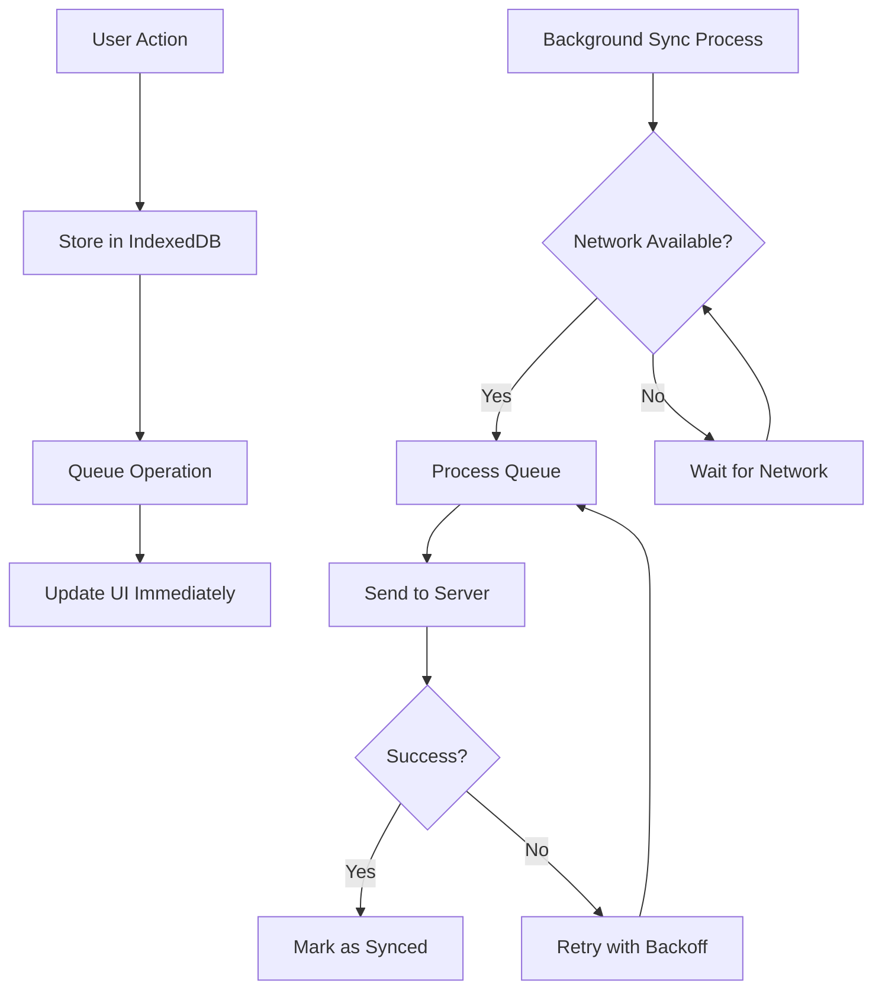

# Sadiid Offline POS - Developer Guide

## 🚀 Quick Start for New Developers

Welcome to the Sadiid Offline POS project! This guide will get you up and running quickly.

### Prerequisites
- Node.js 18+ 
- npm or yarn
- Basic understanding of React, TypeScript, and IndexedDB

### Setup
```bash
# Clone and install
git clone <repository-url>
cd sadiid-offline-pos
npm install

# Start development server
npm run dev
```

### 🏗️ Project Architecture

This is an **offline-first** React application built with:
- **Frontend**: React 18 + TypeScript + Vite
- **Storage**: IndexedDB for offline data persistence
- **UI**: Tailwind CSS + shadcn/ui components
- **State**: React Context + Custom Hooks
- **Sync**: Background queue-based synchronization

## 📋 Key Concepts

### Offline-First Pattern
Every operation in this app follows the offline-first pattern:

```typescript
// ✅ CORRECT - Always works offline
const createSale = async (saleData) => {
  // 1. Save to local storage immediately
  await saveSale(saleData);
  
  // 2. Queue for background sync
  await queueOperation('sale', saleData);
  
  // 3. Update UI immediately
  toast.success('Sale created successfully');
};

// ❌ WRONG - Network dependent
const createSale = async (saleData) => {
  if (navigator.onLine) {
    await apiCreateSale(saleData);
  } else {
    throw new Error('Cannot create sale offline');
  }
};
```

### Core Principles
1. **Local Storage First**: All data goes to IndexedDB immediately
2. **Background Sync**: Network operations happen in background queues
3. **Never Block UI**: Users get immediate feedback, sync happens later
4. **Consistent Behavior**: App works identically online and offline

## 🗂️ Project Structure

```
src/
├── components/           # Reusable UI components
│   ├── ui/              # Base UI components (shadcn/ui)
│   ├── auth/            # Authentication components
│   ├── pos/             # POS-specific components
│   ├── products/        # Product management
│   └── customers/       # Customer management
├── context/             # React Context providers
│   ├── AuthContext.tsx  # User authentication state
│   ├── CartContext.tsx  # Shopping cart state
│   ├── NetworkContext.tsx # Network status monitoring
│   └── BusinessSettingsContext.tsx # Business configuration
├── hooks/               # Custom React hooks
├── lib/                 # Core utilities and services
│   ├── storage.ts       # IndexedDB operations
│   ├── businessSettings.ts # Business configuration
│   └── utils.ts         # General utilities
├── pages/               # Page components (routes)
├── services/            # External services
│   ├── api.ts           # Backend API calls
│   ├── syncQueue.ts     # Background sync queue
│   ├── syncService.ts   # Main sync orchestration
│   └── locationService.ts # Business location management
├── types/               # TypeScript type definitions
└── utils/               # Helper utilities
    ├── apiUtils.ts      # API utility functions
    ├── backgroundSync.ts # Background task management
    ├── dateUtils.ts     # Date/time utilities
    ├── formatting.ts    # Number/currency formatting
    └── productUtils.ts  # Product-specific utilities
```

## 🔄 Data Flow Architecture



## 📊 Database Schema (IndexedDB)

### Core Stores

#### Products Store
```typescript
interface Product {
  id: number;
  name: string;
  type: 'single' | 'variable';
  category_id: number;
  selling_price: number;
  product_variations?: ProductVariation[];
  // ... other fields
}
```

#### Sales Store
```typescript
interface Sale {
  local_id: string;           // Local unique identifier
  contact_id: number;         // Customer ID
  location_id: number;        // Business location
  transaction_date: string;   // ISO timestamp
  final_total: number;        // Total amount
  sell_lines: SellLine[];     // Items sold
  payment_lines: PaymentLine[]; // Payment methods
  is_synced: boolean;         // Sync status
  sync_error?: string;        // Error if sync failed
}
```

#### Sync Queue Store
```typescript
interface QueuedOperation {
  id: string;
  type: 'sale' | 'customer' | 'attendance';
  data: any;                  // Operation payload
  status: 'pending' | 'processing' | 'failed' | 'completed';
  attempts: number;           // Retry count
  error?: string;             // Last error message
  createdAt: string;          // When queued
}
```

## 🔧 Development Patterns

### Adding New Features

1. **Create Storage Functions** (if needed)
```typescript
// lib/storage.ts
export const saveNewEntity = async (entity: NewEntity) => {
  const db = await getDB();
  entity.local_id = generateLocalId();
  entity.is_synced = 0;
  return await db.add('new_entities', entity);
};
```

2. **Add API Endpoints**
```typescript
// services/api.ts
export const createNewEntity = async (entityData: NewEntityData) => {
  const response = await api.post('/connector/api/new-entity', entityData);
  return response.data;
};
```

3. **Update Sync Queue**
```typescript
// services/syncQueue.ts
const processNewEntityOperation = async (operation: QueuedOperation) => {
  const response = await createNewEntity(operation.data);
  if (response.success) {
    await updateEntityWithSyncedData(operation.data.local_id, response.data);
    await updateOperationStatus(operation.id, 'completed');
  }
};
```

4. **Create UI Components**
```typescript
// Follow offline-first pattern in components
const handleSubmit = async (formData) => {
  await saveNewEntity(formData);          // Save locally
  await queueOperation('entity', formData); // Queue for sync
  toast.success('Entity created!');        // Immediate feedback
};
```

### Context Usage

```typescript
// Use contexts for shared state
const { cart, addItem, clearCart } = useCart();
const { isOnline, retryOperation } = useNetwork();
const { settings } = useBusinessSettings();
const { user, isAuthenticated } = useAuth();
```

### Error Handling

```typescript
// Always handle both local and sync errors
try {
  await saveLocally(data);
  await queueForSync(data);
  showSuccess('Operation completed');
} catch (localError) {
  showError('Failed to save locally');
  console.error('Local save failed:', localError);
}
```

## 🔄 Sync System

### Background Sync Flow
1. Operations are queued in IndexedDB
2. Background service runs every minute when online
3. Failed operations retry with exponential backoff
4. Completed operations are cleaned up after 7 days

### Manual Sync Triggers
- User login/app startup
- Network reconnection
- Manual sync button
- Page-specific sync actions

### Monitoring Sync Status
```typescript
// Get queue statistics
const stats = await getQueueStats();
console.log(`Pending: ${stats.pending}, Failed: ${stats.failed}`);

// Check if sync is needed
if (isSyncNeeded()) {
  await processQueue();
}
```

## 🎨 UI Development

### Component Structure
- Use shadcn/ui components as base
- Follow responsive design patterns
- Implement loading states for all async operations
- Add offline indicators where appropriate

### Styling
- Tailwind CSS for styling
- Custom CSS variables for brand colors
- Responsive breakpoints: sm (640px), md (768px), lg (1024px)

### Icons
- Lucide React icon library
- Consistent icon sizing and styling

## 🧪 Testing Considerations

### Offline Testing
1. Disable network in browser dev tools
2. Verify all features work offline
3. Test sync when network returns
4. Verify data persistence across page reloads

### Sync Testing
1. Create operations while offline
2. Verify queue population
3. Go online and verify processing
4. Test retry logic with failed operations

## 🚨 Common Issues & Solutions

### Issue: TypeScript Errors
**Solution**: Ensure all imports use absolute paths with `@/` prefix

### Issue: IndexedDB Not Working
**Solution**: Check browser compatibility and verify database initialization

### Issue: Sync Not Triggering
**Solution**: Verify network context is properly initialized and background service is running

### Issue: UI Not Updating After Sync
**Solution**: Ensure components re-render when local data changes

## 📝 Best Practices

### Code Organization
- Use absolute imports: `import { ... } from '@/components/...'`
- Keep components small and focused
- Extract reusable logic into custom hooks
- Use TypeScript interfaces for all data structures

### Performance
- Batch IndexedDB operations when possible
- Use React.memo for expensive components
- Implement proper loading states
- Avoid blocking operations in UI thread

### Error Handling
- Always provide user feedback
- Log errors for debugging
- Implement graceful fallbacks
- Use proper error boundaries

## 🔗 API Integration

### Authentication
```typescript
// OAuth 2.0 with token refresh
const token = getToken();
api.defaults.headers.Authorization = `Bearer ${token.access_token}`;
```

### Endpoints
- **POST** `/connector/api/sell` - Create sale
- **GET** `/connector/api/sell` - Fetch sales
- **GET** `/connector/api/products` - Fetch products
- **GET** `/connector/api/contacts` - Fetch customers
- **GET** `/connector/api/business-details` - Fetch business settings

### Error Responses
Handle various HTTP status codes appropriately:
- 401: Token expired, refresh or logout
- 429: Rate limited, implement retry with backoff
- 500: Server error, queue operation for retry

## 🚀 Deployment

### Build Process
```bash
npm run build     # Production build
npm run preview   # Preview production build
```

### Environment Variables
```env
VITE_API_BASE_URL=https://erp.sadiid.net
VITE_APP_NAME=Sadiid POS
```

### PWA Features
- Service worker for offline functionality
- App manifest for installation
- Background sync capabilities

## 📚 Additional Resources

- [React Documentation](https://react.dev)
- [TypeScript Handbook](https://www.typescriptlang.org/docs/)
- [IndexedDB Guide](https://developer.mozilla.org/en-US/docs/Web/API/IndexedDB_API)
- [Tailwind CSS](https://tailwindcss.com/docs)
- [shadcn/ui Components](https://ui.shadcn.com)

---

*This guide is maintained to reflect the current state of the project. Update it as new features are added or architecture changes.*
