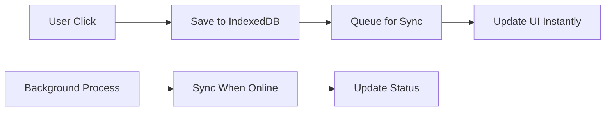

# 🚀 Sadiid Offline POS - Developer Onboarding Guide

> **Welcome to the Team!** This guide will get you productive in the Sadiid Offline POS codebase within hours, not days.

## 📋 Quick Start Checklist

### Prerequisites Setup (5 minutes)
- [ ] **Node.js 18+** installed
- [ ] **Git** configured 
- [ ] **VS Code** with recommended extensions:
  - TypeScript and JavaScript Language Features
  - Tailwind CSS IntelliSense
  - ES7+ React/Redux/React-Native snippets

### Project Setup (5 minutes)
```bash
# Clone and setup
git clone <repository-url>
cd sadiid-offline-pos
npm install

# Start development
npm run dev
# ↳ Opens http://localhost:5173
```

### Environment Configuration
Create `.env` file:
```env
VITE_API_BASE_URL=https://erp.sadiid.net
VITE_APP_NAME=Sadiid POS
VITE_APP_VERSION=1.0.0
```

### Test Access
- Default credentials: See team lead for current test credentials
- ✅ Login should work (even offline)
- ✅ POS should load with sample products
- ✅ Sales can be created without internet

---

## 🏗️ Architecture Overview (10 minutes)

### Core Concept: Offline-First
**Everything works offline. Internet enhances, never enables.**

```typescript
// ✅ CORRECT Pattern - Always used in this codebase
const createSale = async (saleData) => {
  // 1. Save locally FIRST (instant UI response)
  await saveSale(saleData);
  
  // 2. Queue for background sync
  await queueOperation('sale', saleData);
  
  // 3. UI updates immediately
  toast.success('Sale created successfully');
  
  // 4. Background sync happens transparently
};

// ❌ WRONG Pattern - Never used in this codebase
const createSale = async (saleData) => {
  if (navigator.onLine) {
    await api.createSale(saleData); // Blocks user
  } else {
    throw new Error('Cannot create sale offline');
  }
};
```

### Technology Stack
| Layer | Technology | Purpose |
|-------|------------|---------|
| **Frontend** | React 18 + TypeScript | UI and type safety |
| **Storage** | IndexedDB | Local data persistence |
| **Sync** | Custom queue system | Background server sync |
| **UI** | Tailwind + shadcn/ui | Responsive design |
| **Build** | Vite | Fast development |
| **State** | React Context | App-wide state |

---

## 📁 Project Structure (5 minutes)

```
src/
├── components/           # Reusable UI components
│   ├── ui/              # Base components (shadcn/ui)
│   ├── pos/             # POS-specific components
│   └── layouts/         # Page layouts
├── context/             # React Context providers
│   ├── AuthContext     # User authentication
│   ├── CartContext     # Shopping cart state
│   └── NetworkContext  # Online/offline status
├── hooks/              # Custom React hooks
├── lib/                # Core utilities
│   ├── storage.ts      # IndexedDB operations
│   └── businessSettings.ts # Business configuration
├── pages/              # Route components
│   ├── POS.tsx         # Point of sale interface
│   ├── Sales.tsx       # Sales management
│   └── Products.tsx    # Product catalog
├── services/           # External services
│   ├── api.ts          # Backend API calls
│   ├── syncQueue.ts    # Operation queue management
│   └── syncService.ts  # Background sync orchestration
└── utils/              # Helper functions
    ├── formatting.ts   # Currency/date formatting
    └── apiUtils.ts     # Retry logic
```

---

## 🔄 Data Flow Understanding (10 minutes)

### User Action Flow


### Key Files for Data Operations
1. **`lib/storage.ts`** - All IndexedDB operations
2. **`services/syncQueue.ts`** - Queue management
3. **`services/syncService.ts`** - Background sync
4. **`services/api.ts`** - Server communication

---

## 💡 Development Patterns (15 minutes)

### 1. Adding a New Feature
**Always follow this pattern:**

```typescript
// Example: Adding customer creation
const createCustomer = async (customerData) => {
  try {
    // 1. Save locally first (instant response)
    const customerId = await saveContact(customerData);
    
    // 2. Queue for background sync
    await queueOperation('customer', {
      local_id: customerId,
      customerData
    });
    
    // 3. Update UI immediately
    setCustomers(prev => [...prev, { ...customerData, id: customerId }]);
    toast.success('Customer created successfully');
    
    return customerId;
  } catch (error) {
    // Only fails on storage issues, not network
    toast.error('Failed to save customer locally');
    throw error;
  }
};
```

### 2. Reading Data
**Always read from local storage first:**

```typescript
const loadProducts = async () => {
  try {
    // 1. Load from local storage immediately
    const localProducts = await getProducts();
    setProducts(localProducts);
    
    // 2. Background refresh (non-blocking)
    if (navigator.onLine) {
      queueBackgroundTask('REFRESH_PRODUCTS', async () => {
        const freshProducts = await fetchProducts();
        await saveProducts(freshProducts);
        setProducts(freshProducts);
      });
    }
  } catch (error) {
    console.error('Error loading products:', error);
  }
};
```

### 3. Error Handling
**Network errors never block the user:**

```typescript
const handleOperation = async (data) => {
  try {
    // Local operation - can fail on storage issues
    await saveData(data);
    toast.success('Operation completed');
  } catch (error) {
    // Only handle local storage errors
    toast.error('Local storage error');
  }
  
  // Background sync errors are handled separately
  // They don't affect the user experience
};
```

### 4. Sales Management Features
**Edit sales functionality (recently implemented):**

```typescript
// Sales.tsx - Example of complex feature with offline support
const handleEditSale = async (sale: any) => {
  try {
    clearCart(); // Reset current cart state
    
    // Handle both local sales (sell_lines) and synced sales structure
    const saleLines = sale.sell_lines || [];
    
    // Load each sale item into the cart context
    saleLines.forEach((line: any) => {
      addItem({
        product_id: line.product_id,
        name: line.product?.name || line.name,
        price: parseFloat(line.unit_price_inc_tax || 0),
        quantity: parseFloat(line.quantity) || 1,
        // ... other properties
      });
    });
    
    // Set customer and editing state
    if (sale.contact) setCustomer(sale.contact);
    setEditingSale(sale.id || sale.local_id);
    
    // Navigate to POS for editing
    navigate('/pos');
    toast.success('Sale loaded for editing');
  } catch (error) {
    toast.error('Failed to load sale for editing');
  }
};
```

**Key Features Implemented:**
- ✅ Edit any sale (synced or local)
- ✅ Print receipts and bills
- ✅ Handle both online and offline sales
- ✅ Proper error handling and user feedback

---

## 🛠️ Common Development Tasks

### Adding a New Page Component
1. Create component in `src/pages/`
2. Add route in `src/App.tsx`
3. Follow offline-first patterns
4. Use context for shared state

### Adding a New API Endpoint
1. Add function to `services/api.ts`
2. Update sync queue to handle new operation type
3. Add local storage functions in `lib/storage.ts`
4. Test offline functionality

### Modifying Sync Behavior
- **Queue operations**: `services/syncQueue.ts`
- **Background sync**: `services/syncService.ts`
- **Storage operations**: `lib/storage.ts`

### Debugging Sync Issues
```typescript
// Check what's in the queue
const stats = await getQueueStats();
console.log('Queue stats:', stats);

// Check sync status
const unsynced = await getUnSyncedSales();
console.log('Unsynced sales:', unsynced);

// Manual sync trigger
await processQueue();
```

---

## 🧪 Testing Your Changes

### Local Testing Checklist
- [ ] **Offline functionality**: Disable network, test feature
- [ ] **Online sync**: Re-enable network, verify sync
- [ ] **Data persistence**: Refresh page, data should remain
- [ ] **Error handling**: Test with invalid data
- [ ] **UI responsiveness**: Test on different screen sizes

### Key Test Scenarios
1. **Create data offline** → Go online → Verify sync
2. **Network interruption** → Operations should queue
3. **Page refresh** → Local data should persist
4. **Concurrent operations** → No data loss

---

## 📚 Essential Files Reference

### Must-Read Files (Priority 1)
- `src/lib/storage.ts` - Data persistence
- `src/services/syncQueue.ts` - Queue management
- `src/context/CartContext.tsx` - Shopping cart state
- `src/pages/POS.tsx` - Main POS interface

### Important Files (Priority 2)
- `src/services/api.ts` - Server communication
- `src/services/syncService.ts` - Background sync
- `src/utils/formatting.ts` - Data formatting
- `src/context/AuthContext.tsx` - Authentication

### Configuration Files
- `vite.config.ts` - Build configuration
- `tailwind.config.ts` - Styling configuration
- `tsconfig.json` - TypeScript settings

---

## 🔧 Development Tools

### VS Code Extensions (Recommended)
```json
{
  "recommendations": [
    "bradlc.vscode-tailwindcss",
    "esbenp.prettier-vscode",
    "ms-vscode.vscode-typescript-next",
    "unifiedjs.vscode-mdx"
  ]
}
```

### Useful Scripts
```bash
# Development
npm run dev          # Start dev server
npm run build        # Production build
npm run preview      # Preview production build
npm run lint         # Lint code

# Debugging
npm run build        # Check for build errors
npm run type-check   # TypeScript validation
```

### Browser DevTools
- **Application Tab** → IndexedDB → Inspect local data
- **Network Tab** → Verify API calls
- **Console** → Monitor sync operations

---

## 🎯 Key Business Logic

### Sales Flow
1. User adds products to cart (`CartContext`)
2. Checkout saves sale locally (`lib/storage.ts`)
3. Sale queued for sync (`services/syncQueue.ts`)
4. Background sync uploads when online

### Product Management
- Products stored locally in IndexedDB
- Background refresh from server
- Search and filtering on local data

### Customer Management
- Full CRUD operations offline
- Automatic sync to server
- Customer selection in POS

---

## 🚨 Common Pitfalls to Avoid

### ❌ Don't Do This
```typescript
// Never block UI on network calls
if (navigator.onLine) {
  await api.createSale(data); // BLOCKS UI
}

// Never make operations dependent on network
if (!navigator.onLine) {
  throw new Error('Cannot work offline'); // BAD
}

// Never ignore local data
const products = await fetchProducts(); // Ignores local cache
```

### ✅ Do This Instead
```typescript
// Always work locally first
await saveSale(data);
await queueOperation('sale', data);
toast.success('Sale created'); // Instant feedback

// Always work offline
const products = await getProducts(); // Local first
// Background refresh happens separately
```

---

## � API Integration & Documentation (15 minutes)

### OpenAPI Specification
The project includes comprehensive API documentation through OpenAPI:

- **📄 OpenAPI Spec**: [`docs/openapi.yaml`](docs/openapi.yaml) - Complete API specification (81 endpoints)
- **📖 Integration Guide**: [`docs/OPENAPI_INTEGRATION_GUIDE.md`](docs/OPENAPI_INTEGRATION_GUIDE.md) - Detailed setup and usage
- **🧪 Postman Collection**: [`Sadiid_POS_API.postman_collection.json`](Sadiid_POS_API.postman_collection.json) - Interactive testing

### Type-Safe API Client
The project provides a comprehensive API client with TypeScript support:

```typescript
// Import the API client and types
import { apiClient, ProductsApi, TransactionsApi } from '@/lib/api-client';
import { Product, Transaction, ApiResponse } from '@/types/api';

// Use specific API modules for organized code
const products: ApiResponse<Product[]> = await ProductsApi.getProducts({
  page: 1,
  per_page: 20,
  search: 'laptop'
});

// Create new transactions with full type safety
const newSale: ApiResponse<Transaction> = await TransactionsApi.createTransaction({
  location_id: 1,
  contact_id: customer.id,
  transaction_date: new Date().toISOString().split('T')[0],
  products: cartItems.map(item => ({
    product_id: item.product_id,
    variation_id: item.variation_id,
    quantity: item.quantity,
    unit_price: item.price
  })),
  payments: [{
    method: 'cash',
    amount: total,
    paid_on: new Date().toISOString()
  }]
});
```

### API Client Organization
```
src/lib/
├── api-client.ts           # Main API client with auth
└── modules/
    ├── auth.ts            # Authentication endpoints
    ├── products.ts        # Product management
    ├── transactions.ts    # Sales & POS operations
    ├── contacts.ts        # Customer management
    └── business.ts        # Business settings
```

### Useful Commands
```bash
# Generate TypeScript types from OpenAPI spec
npm run generate-types

# Validate OpenAPI specification
npm run validate-openapi

# Serve interactive documentation locally
npm run serve-docs

# Start mock API server for development
npm run api:mock

# Validate API client against spec
npm run api:validate
```

### Interactive Documentation
View the complete API documentation:

1. **Local Swagger UI**: `npm run serve-docs` → http://localhost:3200
2. **Online Swagger Editor**: Upload `docs/openapi.yaml` to [editor.swagger.io](https://editor.swagger.io/)
3. **Postman Collection**: Import the collection for hands-on testing

### API Development Workflow
1. **Check the OpenAPI spec** first for endpoint structure
2. **Use the typed API client** for all server communication
3. **Follow offline-first patterns** - save locally, queue for sync
4. **Validate requests** against the OpenAPI schema when needed
5. **Test both online and offline** scenarios

### Example: Adding a New API Feature
```typescript
// 1. Check if endpoint exists in OpenAPI spec (docs/openapi.yaml)
// 2. Use the appropriate API module
import { ContactsApi } from '@/lib/modules/contacts';
import { Contact, ContactCreateRequest } from '@/types/api';

// 3. Implement with offline-first pattern
const createCustomer = async (customerData: ContactCreateRequest) => {
  try {
    // Save locally first for instant response
    const localCustomer = await saveContactLocally(customerData);
    
    // Queue for background sync
    await queueOperation('contact', {
      action: 'create',
      data: customerData,
      local_id: localCustomer.id
    });
    
    toast.success('Customer created');
    return localCustomer;
  } catch (error) {
    console.error('Failed to create customer:', error);
    toast.error('Failed to create customer');
    throw error;
  }
};

// 4. Background sync handles server communication
const syncContactToServer = async (queuedOperation) => {
  try {
    const serverContact = await ContactsApi.createContact(queuedOperation.data);
    await updateLocalContact(queuedOperation.local_id, {
      server_id: serverContact.data.id,
      sync_status: 'synced'
    });
  } catch (error) {
    // Mark for retry
    await markOperationForRetry(queuedOperation.id);
  }
};
```

### API Categories Overview
| Module | Endpoints | Purpose |
|--------|-----------|---------|
| **AuthApi** | 8 | Login, registration, password management |
| **ProductsApi** | 12 | Product catalog, categories, inventory |
| **TransactionsApi** | 15 | Sales, payments, returns, cash register |
| **ContactsApi** | 8 | Customers, CRM, follow-ups |
| **BusinessApi** | 15+ | Settings, locations, users, reports |

---

## �📞 Getting Help

### Team Resources
- **Architecture Questions**: Review this guide first
- **Code Reviews**: Focus on offline-first patterns
- **Bug Reports**: Include offline/online test results
- **Feature Requests**: Consider offline implications

### Documentation
- **API Reference**: `src/services/api.ts` comments
- **Component Library**: shadcn/ui documentation
- **Database Schema**: `src/lib/storage.ts` interfaces

---

## 🎉 You're Ready!

After reading this guide, you should be able to:
- ✅ Set up the development environment
- ✅ Understand the offline-first architecture
- ✅ Follow the established patterns
- ✅ Add new features correctly
- ✅ Test changes thoroughly

**Next Steps:**
1. Pick a small task from the current sprint
2. Follow the patterns in this guide
3. Ask for code review on your first PR
4. Gradually take on larger features

Welcome to the team! 🚀

---

*Last Updated: June 23, 2025 - Includes latest sales editing, printing, and sync functionality*
