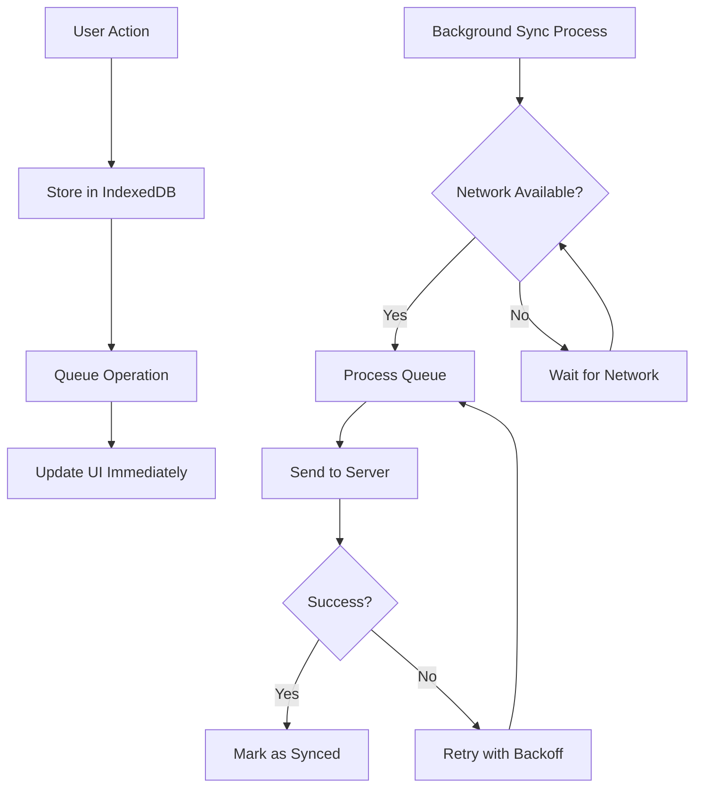
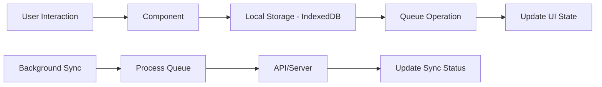

# Sadiid Offline POS - Technical Documentation

## 📚 Documentation Index

### For New Developers
- **[🚀 Developer Onboarding Guide](DEVELOPER_ONBOARDING.md)** - **START HERE!** Complete onboarding for new team members
- **[🛠️ Technical Reference](TECHNICAL_REFERENCE.md)** - Quick reference for experienced developers

### Detailed References
- **[Developer Guide](DEVELOPER_GUIDE.md)** - Additional development patterns, troubleshooting, and API details
- **[API Documentation](API_DOCUMENTATION.md)** - Complete API reference with examples
- **[Deployment Guide](DEPLOYMENT_GUIDE.md)** - Setup, build, and deployment instructions
- **[Complete Code Documentation](DOCUMENTATION.md)** - Detailed file and function reference

### Technical Overview
- [Overview](#overview)
- [Project Status](#project-status) 
- [Technology Stack](#technology-stack)
- [Architecture](#architecture)
- [Core Features](#core-features)
- [Database Design](#database-design)
- [Synchronization System](#synchronization-system)
- [Authentication & Security](#authentication--security)
- [Offline Capabilities](#offline-capabilities)
- [UI Components](#ui-components)
- [Code Structure](#code-structure)
- [Performance Optimizations](#performance-optimizations)
- [PWA Implementation](#pwa-implementation)
- [Development & Deployment](#development--deployment)

## Overview

Sadiid Offline POS is a Progressive Web Application (PWA) that provides a comprehensive Point of Sale solution with robust offline capabilities. The application is designed to work seamlessly both online and offline, ensuring business continuity even in environments with poor internet connectivity.

### Key Features
- **Offline-First Architecture**: Fully functional without internet connection
- **Real-time Synchronization**: Automatic data sync when connection is restored
- **Progressive Web App**: Installable on desktop and mobile devices
- **Responsive Design**: Works across all device sizes
- **Real-time Inventory Management**: Live stock tracking and updates
- **Customer Management**: Comprehensive customer database and history
- **Sales Analytics**: Detailed reporting and sales tracking
- **Multi-location Support**: Business settings and location management

## Project Status

### Current Implementation Status
- ✅ **Core POS Functionality**: Fully implemented and functional
- ✅ **Product Management**: Complete with search and filtering
- ✅ **Customer Management**: Full CRUD operations with sync
- ✅ **Sales Management**: Complete with editing, printing, and sync capabilities
- ✅ **Authentication System**: OAuth 2.0 implementation complete, works offline
- ✅ **Database Schema**: IndexedDB stores defined and working
- ✅ **Network Context**: Online/offline status monitoring
- ✅ **Offline-First Architecture**: Implemented across all core components
- ✅ **Background Sync System**: Queue-based sync with retry logic and error handling
- ✅ **API Integration**: Complete endpoints for POS functionality
- ✅ **Print Functionality**: Receipt and bill printing with offline support
- ✅ **PWA Implementation**: Installable with offline capabilities

### Recent Offline-First Improvements
- **Business Settings**: Loads from cache first, with background refresh
- **Authentication**: Works offline with cached user profiles
- **Dashboard**: Graceful sync handling, no blocking on network status
- **Sales Operations**: Always queue for sync, never block on network
- **Sales Editing**: Edit any sale (synced or local) with full cart integration
- **Print System**: Generate receipts and bills, works completely offline
- **App Initialization**: Streamlined app startup with non-blocking background sync
- **Error Handling**: Comprehensive error surfacing and user feedback
- **Queue Management**: Robust retry logic with exponential backoff

## Technology Stack

### Frontend
- **React 18**: Modern React with hooks and concurrent features
- **TypeScript**: Type-safe development with full IDE support
- **Vite**: Fast build tool and development server
- **Tailwind CSS**: Utility-first CSS framework
- **Shadcn/ui**: Pre-built, accessible UI components
- **Lucide React**: Modern icon library

### State Management
- **React Context API**: Application-wide state management
- **Custom Hooks**: Reusable stateful logic
- **Local State**: Component-level state with useState

### Data Storage
- **IndexedDB**: Client-side database for offline storage
- **idb**: Promise-based IndexedDB wrapper
- **localStorage**: Simple key-value storage for settings

### Network & API
- **Axios**: HTTP client with interceptors
- **OAuth 2.0**: Token-based authentication
- **REST API**: Integration with Sadiid ERP backend

### Development Tools
- **ESLint**: Code linting and style enforcement
- **PostCSS**: CSS processing and optimization
- **TypeScript Compiler**: Type checking and compilation

## Architecture

### Application Structure
```
src/
├── components/          # Reusable UI components
│   ├── ui/             # Base UI components (shadcn/ui)
│   ├── auth/           # Authentication components
│   ├── pos/            # POS-specific components
│   ├── products/       # Product management components
│   └── customers/      # Customer management components
├── context/            # React Context providers
├── hooks/              # Custom React hooks
├── lib/                # Utility libraries
├── pages/              # Page components (routes)
├── services/           # API and external services
├── types/              # TypeScript type definitions
└── utils/              # Helper utilities
```

### Component Hierarchy
```
App
├── AppInitializer (Data loading)
├── AuthContext (Authentication state)
├── NetworkContext (Network status)
├── BusinessSettingsContext (Business configuration)
├── CartContext (Shopping cart state)
├── CustomerContext (Customer selection)
└── Router
    ├── ProtectedLayout
    │   ├── Header
    │   ├── Sidebar
    │   └── Page Components
    └── Login (Public route)
```

## Core Features

### 1. Point of Sale (POS)
**File**: [`src/pages/POS.tsx`](src/pages/POS.tsx)

The POS interface is the heart of the application, providing:
- **Product Grid**: Visual product catalog with search and filtering
- **Cart Management**: Real-time cart updates with quantity controls
- **Customer Selection**: Quick customer lookup and assignment
- **Payment Processing**: Multiple payment methods support
- **Receipt Generation**: Automatic receipt creation and printing

**Key Components**:
- [`POSProductGrid`](src/components/pos/POSProductGrid.tsx): Displays products in a grid layout
- [`POSOrderDetails`](src/components/pos/POSOrderDetails.tsx): Shopping cart and checkout interface
- [`POSCategoryFilters`](src/components/pos/POSCategoryFilters.tsx): Product category filtering

### 2. Product Management
**File**: [`src/pages/Products.tsx`](src/pages/Products.tsx)

Comprehensive product catalog management:
- **Product Listing**: Paginated product display
- **Search & Filter**: Advanced product search capabilities
- **Inventory Tracking**: Real-time stock level monitoring
- **Category Management**: Product categorization system

### 3. Customer Management
**File**: [`src/pages/Customers.tsx`](src/pages/Customers.tsx)

Customer relationship management features:
- **Customer Database**: Complete customer information storage
- **Purchase History**: Track customer transaction history
- **Contact Information**: Phone, email, and address management
- **Customer Search**: Quick customer lookup by name or phone

### 4. Sales Management
**File**: [`src/pages/Sales.tsx`](src/pages/Sales.tsx)

Complete sales management and analytics:
- **Transaction History**: Complete sales record keeping with pagination
- **Sales Editing**: Edit any sale (synced or local) with full cart integration
- **Print Functionality**: Generate receipts and bills, works offline
- **Sync Status Monitoring**: Real-time sync status for each transaction
- **Payment Details**: Track payment methods and amounts
- **Business Reporting**: Sales performance metrics and analytics

**Recent Features**:
- Edit sales with automatic cart prefill and customer assignment
- Print receipts (app-generated) and bills (server URLs) 
- Handle both synced and local sales seamlessly
- Comprehensive error handling and user feedback

## Database Design

### IndexedDB Schema

The application uses IndexedDB for offline data storage with the following stores:

#### 1. Products Store
```typescript
interface Product {
  id: number;
  name: string;
  type: 'single' | 'variable';
  image?: string;
  enable_stock: 1 | 0;
  unit_id: number;
  brand_id: number;
  category_id: number;
  sub_category_id?: number;
  product_description?: string;
  selling_price: number;
  selling_price_inc_tax: number;
  variations?: ProductVariation[];
  media?: ProductMedia[];
}
```

#### 2. Contacts Store
```typescript
interface Contact {
  id: number;
  type: 'customer' | 'supplier';
  supplier_business_name?: string;
  name: string;
  prefix?: string;
  first_name: string;
  middle_name?: string;
  last_name?: string;
  email?: string;
  contact_id: string;
  mobile: string;
  address_line_1?: string;
  address_line_2?: string;
  city?: string;
  state?: string;
  country?: string;
  zip_code?: string;
}
```

#### 3. Sales Store
```typescript
interface Sale {
  local_id: string;
  contact_id: number;
  location_id: number;
  transaction_date: string;
  final_total: number;
  tax_amount: number;
  discount_amount: number;
  sell_lines: SellLine[];
  payment_lines: PaymentLine[];
  is_synced: boolean;
  created_at: string;
}
```

#### 4. Sync Queue Store
```typescript
interface QueuedOperation {
  id: string;
  type: 'sale' | 'customer' | 'attendance';
  data: any;
  createdAt: string;
  attempts: number;
  lastAttempt?: string;
  status: 'pending' | 'processing' | 'failed' | 'completed';
  error?: string;
}
```

## Synchronization System

### Architecture Overview

The synchronization system is built on an **offline-first** principle where all user interactions are stored locally first, then synchronized with the server in the background.

#### 1. Sync Service (`src/services/syncService.ts`)
Handles the main synchronization logic:
- **Background Synchronization**: All sync happens in background, never blocking UI
- **Data Freshness Checking**: Determines when data needs updating from server
- **Batch Synchronization**: Efficient bulk data transfer
- **Retry Logic**: Automatic retry for failed operations with exponential backoff
- **Progress Tracking**: Real-time sync status updates
- **Network Event Handling**: Responds to online/offline status changes

#### 2. Sync Queue (`src/services/syncQueue.ts`)
Manages all operations queue (both online and offline):
- **Operation Queuing**: Store ALL user actions for later sync
- **Queue Processing**: Batch process queued operations when online
- **Error Handling**: Retry failed operations with exponential backoff
- **Queue Persistence**: Maintain queue across app restarts and network changes
- **Status Tracking**: Monitor operation states (pending, processing, completed, failed)
- **Cleanup**: Automatic cleanup of completed operations

### Offline-First Data Flow



### Sync Strategies

#### 1. User Actions (Client → Queue → Server)
**All user actions follow this pattern:**
- **Sales Transactions**: Store → Queue → Sync to server
- **Customer Creation/Updates**: Store → Queue → Sync to server  
- **Inventory Changes**: Store → Queue → Sync to server
- **Attendance Records**: Store → Queue → Sync to server

**Key Principle**: Never block the user interface waiting for network calls.

#### 2. Data Updates (Server → Client)
**Background data refresh:**
- **Products**: Fetch fresh data every 24 hours or on demand
- **Customers**: Fetch updates every 6 hours or on demand
- **Business Settings**: Fetch on login and periodically
- **Categories**: Fetch with products or separately

### Implementation Details

#### Offline-First User Flow Example:
```typescript
// ❌ WRONG - Direct API call when online
if (isOnline) {
  await createSale(saleData);
} else {
  await saveSaleLocally(saleData);
}

// ✅ CORRECT - Always store locally first
await saveSale(saleData); // Always saves to IndexedDB
await queueOperation('sale', saleData); // Always queues for sync
// Background process handles sync when network available
```

#### Queue Processing Logic:
```typescript
export const processQueue = async (): Promise<void> => {
  if (!navigator.onLine) return;
  
  const pendingOps = await getOperationsByStatus('pending');
  
  for (const operation of pendingOps) {
    try {
      await updateOperationStatus(operation.id, 'processing');
      
      switch (operation.type) {
        case 'sale':
          await syncSaleToServer(operation.data);
          break;
        case 'customer':
          await syncCustomerToServer(operation.data);
          break;
        // ... other operation types
      }
      
      await updateOperationStatus(operation.id, 'completed');
    } catch (error) {
      await updateOperationStatus(operation.id, 'failed', error.message);
    }
  }
};
```

### Data Consistency Strategy

#### 1. Local-First Operations
- **Immediate Response**: UI updates instantly from local data
- **Eventual Consistency**: Server sync happens in background
- **Conflict Resolution**: Last-write-wins with timestamp comparison
- **Data Integrity**: Local validation before queuing

#### 2. Server Data Updates
- **Pull-Based**: Client requests fresh data periodically
- **Incremental Sync**: Only fetch changes since last sync
- **Merge Strategy**: Merge server updates with local changes
- **Fallback**: Always prefer local data if server unavailable

#### 3. Network State Handling
```typescript
// Network becomes available
window.addEventListener('online', () => {
  processQueue(); // Start processing pending operations
  syncDataFromServer(); // Fetch fresh data from server
});

// Network becomes unavailable  
window.addEventListener('offline', () => {
  // Continue normal operation with local data
  // All operations continue to be queued
});
```
## Code Structure

### State Management Pattern

The application uses a combination of React Context and local state with offline-first principles:

#### 1. Global State (Context)
- **AuthContext**: User authentication state
- **CartContext**: Shopping cart state (always local)
- **CustomerContext**: Selected customer state (from IndexedDB)
- **NetworkContext**: Network connection status
- **BusinessSettingsContext**: Business configuration (cached locally)

#### 2. Local State (Component)
- **UI State**: Component-specific UI state
- **Form State**: Form input and validation state
- **Loading States**: Background sync operation status (never blocks UI)

### Data Flow Pattern



**Key Principles:**
1. **User interactions never wait for network**
2. **All data flows through IndexedDB first**
3. **UI always reflects local state**
4. **Sync happens transparently in background**

### Error Handling Strategy

#### 1. Network Independence
```typescript
// ❌ WRONG - Network-dependent error handling
try {
  if (isOnline) {
    await createSale(saleData);
  } else {
    throw new Error('Cannot create sale while offline');
  }
} catch (error) {
  showError('Sale creation failed');
}

// ✅ CORRECT - Network-independent operation
try {
  await saveSale(saleData); // Always succeeds locally
  await queueOperation('sale', saleData); // Always queues
  showSuccess('Sale created successfully'); // Always shows success
} catch (error) {
  showError('Failed to save sale locally'); // Only fails on storage issues
}
```

#### 2. Background Sync Error Handling
```typescript
// Background sync handles network errors gracefully
export const syncSaleToServer = async (saleData: any) => {
  try {
    const result = await createSale(saleData);
    if (result.success) {
      await markSaleAsSynced(saleData.local_id);
      return true;
    }
    throw new Error(result.error);
  } catch (error) {
    // Schedule retry with exponential backoff
    await scheduleRetry(saleData, error);
    return false;
  }
};
```

#### 3. Component Error Boundaries
- **Graceful Degradation**: Handle component errors gracefully
- **User Feedback**: Show meaningful status messages about sync
- **Error Recovery**: Provide manual sync retry mechanisms

## Offline Capabilities

### Offline-First Design

The application is built with a true offline-first approach where **network connectivity is treated as an enhancement, not a requirement**.

#### 1. Data Availability
- **Complete Product Catalog**: Full product database stored locally
- **Customer Information**: Complete customer database offline
- **Business Settings**: All configuration data available offline
- **Transaction History**: All transactions stored locally immediately

#### 2. Functionality Preservation
- **Sales Processing**: Complete POS functionality always available
- **Customer Management**: Add and edit customers without network
- **Product Browsing**: Full product catalog access offline
- **Report Generation**: All reporting from local data

#### 3. Queue Management
**File**: [`src/services/syncQueue.ts`](src/services/syncQueue.ts)

All operations are queued regardless of network status:

```typescript
export const queueOperation = async (
  type: QueueableOperationType, 
  data: any
): Promise<string> => {
  const operation: QueuedOperation = {
    id: `${type}_${Date.now()}_${Math.random().toString(36).substring(2, 9)}`,
    type,
    data,
    createdAt: new Date().toISOString(),
    attempts: 0,
    status: 'pending'
  };
  
  const db = await initSyncQueueDB();
  await db.add(QUEUE_STORE_NAME, operation);
  
  // If online, start background processing
  if (navigator.onLine) {
    processQueue(); // Non-blocking background process
  }
  
  return operation.id;
};
```

#### 4. User Experience Principles

**Immediate Feedback:**
- All user actions complete instantly
- UI never shows loading states for user operations
- Success messages appear immediately after local storage

**Background Sync Indicators:**
- Subtle sync status indicators in UI
- Non-intrusive notifications for sync completion
- Clear indication of items pending sync

**Network Transparency:**
- Application works identically online and offline
- Network status visible but doesn't change functionality
- Automatic sync when network becomes available

### Network Status Monitoring
**File**: [`src/context/NetworkContext.tsx`](src/context/NetworkContext.tsx)

Network monitoring is used for sync optimization, not functionality:

```typescript
export const NetworkContext = () => {
  const [isOnline, setIsOnline] = useState(navigator.onLine);
  
  useEffect(() => {
    const handleOnline = () => {
      setIsOnline(true);
      // Start background sync - never blocks UI
      processQueue();
      syncDataFromServer();
    };
    
    const handleOffline = () => {
      setIsOnline(false);
      // Application continues normally
    };
    
    window.addEventListener('online', handleOnline);
    window.addEventListener('offline', handleOffline);
    
    return () => {
      window.removeEventListener('online', handleOnline);
      window.removeEventListener('offline', handleOffline);
    };
  }, []);
};
```

**Key Features:**
- **Background Sync Trigger**: Start sync when connection restored
- **User Notifications**: Inform users of sync status (not functionality status)
- **Graceful Enhancement**: Online connectivity enhances but doesn't enable features

## Performance Optimizations

#### 1. Offline-First Optimizations
```typescript
// Instant local operations
const addToCart = async (product: Product) => {
  // Immediate UI update
  updateCartState(product);
  
  // Background storage (non-blocking)
  saveCartToStorage(cartState);
};

// Background sync optimization
const debouncedSync = debounce(processQueue, 5000); // Batch sync operations
```

#### 2. Storage Optimizations
```typescript
// Batch IndexedDB operations for better performance
export const batchSaveOperations = async (operations: QueuedOperation[]) => {
  const db = await initSyncQueueDB();
  const tx = db.transaction('operations', 'readwrite');
  
  for (const operation of operations) {
    tx.store.add(operation);
  }
  
  await tx.done;
};
```

#### 3. Background Processing
- **Non-blocking Sync**: All sync operations happen in background
- **Intelligent Batching**: Group similar operations for efficiency
- **Resource Management**: Limit concurrent sync operations

## PWA Implementation

### Service Worker Configuration
**File**: [`vite.config.ts`](vite.config.ts)

The application is configured as a PWA using Vite PWA plugin:

```typescript
VitePWA({
  registerType: 'autoUpdate',
  includeAssets: ['favicon.svg', 'robots.txt', 'apple-touch-icon.png'],
  manifest: {
    name: 'Sadiid POS',
    short_name: 'SadiidPOS',
    description: 'Sadiid ERP Cloud POS',
    theme_color: '#0284c7',
    background_color: '#ffffff',
    display: 'standalone',
    start_url: '/',
    icons: [
      {
        src: '/favicon.svg',
        sizes: 'any',
        type: 'image/svg+xml',
      },
      {
        src: '/pwa-192x192.png',
        sizes: '192x192',
        type: 'image/png',
      },
      {
        src: '/pwa-512x512.png',
        sizes: '512x512',
        type: 'image/png',
      },
    ],
  },
})
```

### PWA Features
- **Installable**: Can be installed on desktop and mobile devices
- **Offline Support**: Full functionality without internet connection
- **Background Sync**: Sync data when connection is restored
- **Push Notifications**: Server-sent notifications (future enhancement)
- **App Shell**: Fast loading with cached shell

### Caching Strategy
- **Cache First**: Static assets (CSS, JS, images)
- **Network First**: API calls with fallback to cache
- **Stale While Revalidate**: Dynamic content with background updates

## Development & Deployment

### Development Setup

#### 1. Prerequisites
```bash
# Node.js 18+ and npm
node --version  # Should be 18+
npm --version   # Should be 8+
```

#### 2. Installation
```bash
# Clone repository
git clone <repository-url>
cd sadiid-offline-pos

# Install dependencies
npm install

# Start development server
npm run dev
```

#### 3. Development Commands
```bash
npm run dev          # Start development server
npm run build        # Build for production
npm run preview      # Preview production build
npm run lint         # Run ESLint
npm run type-check   # TypeScript type checking
```

### Build Process

#### 1. TypeScript Compilation
- **Type Checking**: Full TypeScript type checking
- **Code Generation**: Compile TypeScript to JavaScript
- **Source Maps**: Generate source maps for debugging

#### 2. Asset Optimization
- **CSS Processing**: PostCSS and Tailwind compilation
- **Image Optimization**: Compress and optimize images
- **Bundle Splitting**: Code splitting for optimal loading

#### 3. PWA Generation
- **Service Worker**: Generate service worker for offline support
- **Manifest**: Create web app manifest for installation
- **Icon Generation**: Generate various icon sizes

### Deployment Strategy

#### 1. Static Hosting
The application can be deployed to any static hosting service:
- **Netlify**: Automatic deployments from Git
- **Vercel**: Optimized for React applications
- **GitHub Pages**: Free hosting for open source
- **AWS S3**: Scalable cloud hosting

#### 2. Environment Configuration
```typescript
// Environment variables
VITE_API_BASE_URL=https://erp.sadiid.net
VITE_CLIENT_ID=48
VITE_CLIENT_SECRET=cEM0njAX1oCo9OK4NDdwjEyWr1KKmjt6545j6zSf
```

#### 3. Production Optimizations
- **Gzip Compression**: Enable gzip compression
- **CDN Integration**: Use CDN for static assets
- **Caching Headers**: Set appropriate cache headers
- **Performance Monitoring**: Monitor application performance

### Testing Strategy

#### 1. Unit Testing
- **Component Testing**: Test individual components
- **Service Testing**: Test business logic
- **Utility Testing**: Test helper functions

#### 2. Integration Testing
- **API Integration**: Test API communication
- **Database Operations**: Test IndexedDB operations
- **Sync Functionality**: Test offline sync

#### 3. E2E Testing
- **User Flows**: Test complete user journeys
- **Offline Scenarios**: Test offline functionality
- **PWA Features**: Test installation and offline usage

## Development & Deployment

### Getting Started
For new developers joining the team, follow this sequence:

1. **Start Here**: [`DEVELOPER_ONBOARDING.md`](DEVELOPER_ONBOARDING.md) - Complete setup and onboarding guide
2. **Quick Reference**: [`TECHNICAL_REFERENCE.md`](TECHNICAL_REFERENCE.md) - Architecture patterns and critical files
3. **Detailed Reference**: [`DOCUMENTATION.md`](DOCUMENTATION.md) - Complete file and function reference
4. **API Integration**: [`API_DOCUMENTATION.md`](API_DOCUMENTATION.md) - Backend endpoints and examples
5. **Deployment**: [`DEPLOYMENT_GUIDE.md`](DEPLOYMENT_GUIDE.md) - Build and deployment instructions

### Build Commands
```bash
npm install          # Install dependencies
npm run dev         # Start development server
npm run build       # Production build
npm run preview     # Preview production build
npm run lint        # Run code linting
```

### Environment Setup
```env
VITE_API_BASE_URL=https://erp.sadiid.net
VITE_APP_NAME=Sadiid POS
VITE_APP_VERSION=1.0.0
```

## Conclusion

The Sadiid Offline POS application represents a mature offline-first point-of-sale solution. Its architecture ensures that **users can always complete their work immediately**, regardless of network connectivity, while background synchronization maintains data consistency with the server.

**Core Strengths:**
- **Reliability**: Never dependent on network connectivity
- **Performance**: Instant response to all user actions
- **User Experience**: Consistent behavior online and offline
- **Data Integrity**: Robust queue system with retry logic prevents data loss
- **Scalability**: Background sync scales with usage patterns
- **Maintainability**: Comprehensive documentation for team onboarding

**Key Features Implemented:**
- Complete POS functionality with offline support
- Sales editing and printing capabilities
- Customer and product management
- Real-time sync with error handling
- PWA installation and offline caching
- Comprehensive error reporting and user feedback

The application is production-ready and provides a reliable foundation for retail operations in any network environment.

---

*Last Updated: June 23, 2025*
*Version: 1.0.0*
*Status: Production Ready - Complete Offline-First Architecture*
