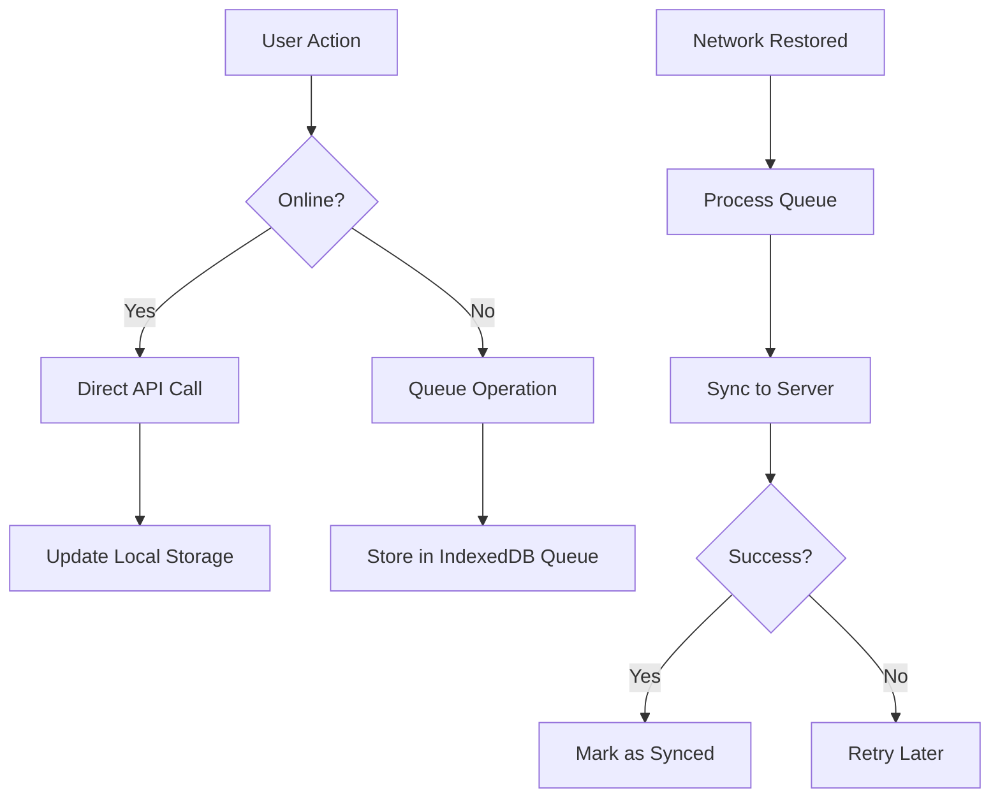
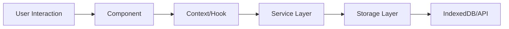

# Sadiid Offline POS - Technical Documentation

## Table of Contents
1. [Overview](#overview)
2. [Technology Stack](#technology-stack)
3. [Architecture](#architecture)
4. [Core Features](#core-features)
5. [Database Design](#database-design)
6. [Synchronization System](#synchronization-system)
7. [Authentication & Security](#authentication--security)
8. [Offline Capabilities](#offline-capabilities)
9. [UI Components](#ui-components)
10. [Code Structure](#code-structure)
11. [Performance Optimizations](#performance-optimizations)
12. [PWA Implementation](#pwa-implementation)
13. [Development & Deployment](#development--deployment)

## Overview

Sadiid Offline POS is a Progressive Web Application (PWA) that provides a comprehensive Point of Sale solution with robust offline capabilities. The application is designed to work seamlessly both online and offline, ensuring business continuity even in environments with poor internet connectivity.

### Key Features
- **Offline-First Architecture**: Fully functional without internet connection
- **Real-time Synchronization**: Automatic data sync when connection is restored
- **Progressive Web App**: Installable on desktop and mobile devices
- **Responsive Design**: Works across all device sizes
- **Real-time Inventory Management**: Live stock tracking and updates
- **Customer Management**: Comprehensive customer database and history
- **Sales Analytics**: Detailed reporting and sales tracking
- **Multi-location Support**: Business settings and location management

## Technology Stack

### Frontend
- **React 18**: Modern React with hooks and concurrent features
- **TypeScript**: Type-safe development with full IDE support
- **Vite**: Fast build tool and development server
- **Tailwind CSS**: Utility-first CSS framework
- **Shadcn/ui**: Pre-built, accessible UI components
- **Lucide React**: Modern icon library

### State Management
- **React Context API**: Application-wide state management
- **Custom Hooks**: Reusable stateful logic
- **Local State**: Component-level state with useState

### Data Storage
- **IndexedDB**: Client-side database for offline storage
- **idb**: Promise-based IndexedDB wrapper
- **localStorage**: Simple key-value storage for settings

### Network & API
- **Axios**: HTTP client with interceptors
- **OAuth 2.0**: Token-based authentication
- **REST API**: Integration with Sadiid ERP backend

### Development Tools
- **ESLint**: Code linting and style enforcement
- **PostCSS**: CSS processing and optimization
- **TypeScript Compiler**: Type checking and compilation

## Architecture

### Application Structure
```
src/
├── components/          # Reusable UI components
│   ├── ui/             # Base UI components (shadcn/ui)
│   ├── auth/           # Authentication components
│   ├── pos/            # POS-specific components
│   ├── products/       # Product management components
│   └── customers/      # Customer management components
├── context/            # React Context providers
├── hooks/              # Custom React hooks
├── lib/                # Utility libraries
├── pages/              # Page components (routes)
├── services/           # API and external services
├── types/              # TypeScript type definitions
└── utils/              # Helper utilities
```

### Component Hierarchy
```
App
├── AppInitializer (Data loading)
├── AuthContext (Authentication state)
├── NetworkContext (Network status)
├── BusinessSettingsContext (Business configuration)
├── CartContext (Shopping cart state)
├── CustomerContext (Customer selection)
└── Router
    ├── ProtectedLayout
    │   ├── Header
    │   ├── Sidebar
    │   └── Page Components
    └── Login (Public route)
```

## Core Features

### 1. Point of Sale (POS)
**File**: `src/pages/POS.tsx`

The POS interface is the heart of the application, providing:
- **Product Grid**: Visual product catalog with search and filtering
- **Cart Management**: Real-time cart updates with quantity controls
- **Customer Selection**: Quick customer lookup and assignment
- **Payment Processing**: Multiple payment methods support
- **Receipt Generation**: Automatic receipt creation and printing

**Key Components**:
- `POSProductGrid`: Displays products in a grid layout
- `POSOrderDetails`: Shopping cart and checkout interface
- `POSCategoryFilters`: Product category filtering

### 2. Product Management
**File**: `src/pages/Products.tsx`

Comprehensive product catalog management:
- **Product Listing**: Paginated product display
- **Search & Filter**: Advanced product search capabilities
- **Inventory Tracking**: Real-time stock level monitoring
- **Category Management**: Product categorization system

### 3. Customer Management
**File**: `src/pages/Customers.tsx`

Customer relationship management features:
- **Customer Database**: Complete customer information storage
- **Purchase History**: Track customer transaction history
- **Contact Information**: Phone, email, and address management
- **Customer Search**: Quick customer lookup by name or phone

### 4. Sales Tracking
**File**: `src/pages/Sales.tsx`

Sales analytics and reporting:
- **Transaction History**: Complete sales record keeping
- **Sync Status**: Monitor offline transaction synchronization
- **Payment Details**: Track payment methods and amounts
- **Business Reporting**: Sales performance metrics

## Database Design

### IndexedDB Schema

The application uses IndexedDB for offline data storage with the following stores:

#### 1. Products Store
```typescript
interface Product {
  id: number;
  name: string;
  type: 'single' | 'variable';
  image?: string;
  enable_stock: 1 | 0;
  unit_id: number;
  brand_id: number;
  category_id: number;
  sub_category_id?: number;
  product_description?: string;
  selling_price: number;
  selling_price_inc_tax: number;
  variations?: ProductVariation[];
  media?: ProductMedia[];
}
```

#### 2. Contacts Store
```typescript
interface Contact {
  id: number;
  type: 'customer' | 'supplier';
  supplier_business_name?: string;
  name: string;
  prefix?: string;
  first_name: string;
  middle_name?: string;
  last_name?: string;
  email?: string;
  contact_id: string;
  mobile: string;
  address_line_1?: string;
  address_line_2?: string;
  city?: string;
  state?: string;
  country?: string;
  zip_code?: string;
}
```

#### 3. Sales Store
```typescript
interface Sale {
  local_id: string;
  contact_id: number;
  location_id: number;
  transaction_date: string;
  final_total: number;
  tax_amount: number;
  discount_amount: number;
  sell_lines: SellLine[];
  payment_lines: PaymentLine[];
  is_synced: boolean;
  created_at: string;
}
```

#### 4. Sync Queue Store
```typescript
interface QueuedOperation {
  id: string;
  type: 'sale' | 'customer' | 'attendance';
  data: any;
  createdAt: string;
  attempts: number;
  lastAttempt?: string;
  status: 'pending' | 'processing' | 'failed' | 'completed';
  error?: string;
}
```

## Synchronization System

### Architecture Overview

The synchronization system consists of two main components:

#### 1. Sync Service (`src/services/syncService.ts`)
Handles the main synchronization logic:
- **Data Freshness Checking**: Determines when data needs updating
- **Batch Synchronization**: Efficient bulk data transfer
- **Retry Logic**: Automatic retry for failed operations
- **Progress Tracking**: Real-time sync status updates

#### 2. Sync Queue (`src/services/syncQueue.ts`)
Manages offline operations queue:
- **Operation Queuing**: Store offline actions for later sync
- **Queue Processing**: Batch process queued operations
- **Error Handling**: Retry failed operations with backoff
- **Queue Persistence**: Maintain queue across app restarts

### Sync Flow



### Sync Strategies

#### 1. Pull Synchronization (Server → Client)
- **Products**: Every 24 hours or on demand
- **Customers**: Every 6 hours or on demand
- **Business Settings**: On login and periodically

#### 2. Push Synchronization (Client → Server)
- **Sales Transactions**: Immediate when online, queued when offline
- **New Customers**: Immediate when online, queued when offline
- **Attendance Records**: Immediate when online, queued when offline

## Authentication & Security

### OAuth 2.0 Implementation
**File**: `src/services/api.ts`

The application uses OAuth 2.0 password grant flow:

```typescript
const login = async (username: string, password: string) => {
  const formData = new FormData();
  formData.append('grant_type', 'password');
  formData.append('client_id', '48');
  formData.append('client_secret', 'cEM0njAX1oCo9OK4NDdwjEyWr1KKmjt6545j6zSf');
  formData.append('username', username);
  formData.append('password', password);

  const response = await axios.post(`${BASE_URL}/oauth/token`, formData);
  return response.data;
};
```

### Security Features
- **Token-based Authentication**: Secure JWT tokens
- **Automatic Token Refresh**: Seamless session management
- **Route Protection**: Protected routes with authentication checks
- **Session Expiry Handling**: Automatic logout on token expiration
- **Secure Storage**: Encrypted token storage

### Authentication Context
**File**: `src/context/AuthContext.tsx`

Manages application-wide authentication state:
- **Login/Logout**: User session management
- **Token Storage**: Secure token persistence
- **User Information**: Current user data management
- **Authentication Status**: Real-time auth state tracking

## Offline Capabilities

### Offline-First Design

The application is built with an offline-first approach:

#### 1. Data Availability
- **Complete Product Catalog**: Full product database stored locally
- **Customer Information**: Complete customer database offline
- **Business Settings**: All configuration data available offline
- **Transaction History**: Local storage of all transactions

#### 2. Functionality Preservation
- **Sales Processing**: Complete POS functionality offline
- **Customer Management**: Add and edit customers offline
- **Product Browsing**: Full product catalog access
- **Report Generation**: Basic reporting from local data

#### 3. Queue Management
**File**: `src/services/syncQueue.ts`

```typescript
export const queueOperation = async (
  type: QueueableOperationType, 
  data: any
): Promise<string> => {
  const operation: QueuedOperation = {
    id: `${type}_${Date.now()}_${Math.random().toString(36).substring(2, 9)}`,
    type,
    data,
    createdAt: new Date().toISOString(),
    attempts: 0,
    status: 'pending'
  };
  
  const db = await initSyncQueueDB();
  await db.add(QUEUE_STORE_NAME, operation);
  return operation.id;
};
```

### Network Status Monitoring
**File**: `src/context/NetworkContext.tsx`

Real-time network status tracking:
- **Connection Detection**: Monitor online/offline status
- **Automatic Sync Trigger**: Start sync when connection restored
- **User Notifications**: Inform users of network status changes
- **Graceful Degradation**: Smooth transition between online/offline modes

## UI Components

### Design System

The application uses a comprehensive design system built on:
- **Shadcn/ui**: Base component library
- **Tailwind CSS**: Utility-first styling
- **Responsive Design**: Mobile-first approach
- **Accessibility**: WCAG compliance

### Component Categories

#### 1. Base UI Components (`src/components/ui/`)
- **Button**: Various button styles and states
- **Input**: Form input components with validation
- **Table**: Data display with sorting and pagination
- **Card**: Content containers with consistent styling
- **Badge**: Status indicators and labels
- **Dialog**: Modal dialogs and overlays

#### 2. Business Components

##### POS Components (`src/components/pos/`)
- **POSProductGrid**: Product display grid with search
- **POSOrderDetails**: Shopping cart and checkout
- **POSCategoryFilters**: Product category navigation

##### Product Components (`src/components/products/`)
- **ProductCard**: Individual product display
- **ProductList**: Product listing with pagination

##### Customer Components (`src/components/customers/`)
- **CustomerList**: Customer database display

### Responsive Design

The application uses a mobile-first responsive design:

```css
/* Mobile First */
.grid { grid-template-columns: 1fr; }

/* Tablet */
@media (min-width: 768px) {
  .grid { grid-template-columns: repeat(2, 1fr); }
}

/* Desktop */
@media (min-width: 1024px) {
  .grid { grid-template-columns: repeat(3, 1fr); }
}
```

## Code Structure

### State Management Pattern

The application uses a combination of React Context and local state:

#### 1. Global State (Context)
- **AuthContext**: User authentication state
- **CartContext**: Shopping cart state
- **CustomerContext**: Selected customer state
- **NetworkContext**: Network connection status
- **BusinessSettingsContext**: Business configuration

#### 2. Local State (Component)
- **UI State**: Component-specific UI state
- **Form State**: Form input and validation state
- **Loading States**: Async operation status

### Data Flow Pattern



### Error Handling Strategy

#### 1. API Error Handling
```typescript
api.interceptors.response.use(
  (response) => response,
  async (error) => {
    if (error.response?.status === 401) {
      // Handle authentication errors
      removeToken();
      window.location.href = '/login';
    }
    
    if (!navigator.onLine) {
      // Handle offline errors
      return Promise.reject({ isOffline: true, ...error });
    }
    
    return Promise.reject(error);
  }
);
```

#### 2. Component Error Boundaries
- **Graceful Degradation**: Handle component errors gracefully
- **User Feedback**: Show meaningful error messages
- **Error Recovery**: Provide retry mechanisms

### Performance Optimizations

#### 1. Code Splitting
```typescript
// Lazy load pages
const POS = lazy(() => import('./pages/POS'));
const Products = lazy(() => import('./pages/Products'));
```

#### 2. Memoization
```typescript
// Memoize expensive calculations
const memoizedProductList = useMemo(() => 
  products.filter(product => 
    product.name.toLowerCase().includes(searchTerm.toLowerCase())
  ), [products, searchTerm]
);
```

#### 3. Virtual Scrolling
- **Large Lists**: Virtualize large product and customer lists
- **Memory Efficiency**: Render only visible items
- **Smooth Scrolling**: Maintain 60fps scrolling performance

## PWA Implementation

### Service Worker Configuration
**File**: `vite.config.ts`

The application is configured as a PWA using Vite PWA plugin:

```typescript
VitePWA({
  registerType: 'autoUpdate',
  includeAssets: ['favicon.svg', 'robots.txt', 'apple-touch-icon.png'],
  manifest: {
    name: 'Sadiid POS',
    short_name: 'SadiidPOS',
    description: 'Sadiid ERP Cloud POS',
    theme_color: '#0284c7',
    background_color: '#ffffff',
    display: 'standalone',
    start_url: '/',
    icons: [
      {
        src: '/favicon.svg',
        sizes: 'any',
        type: 'image/svg+xml',
      },
      {
        src: '/pwa-192x192.png',
        sizes: '192x192',
        type: 'image/png',
      },
      {
        src: '/pwa-512x512.png',
        sizes: '512x512',
        type: 'image/png',
      },
    ],
  },
})
```

### PWA Features
- **Installable**: Can be installed on desktop and mobile devices
- **Offline Support**: Full functionality without internet connection
- **Background Sync**: Sync data when connection is restored
- **Push Notifications**: Server-sent notifications (future enhancement)
- **App Shell**: Fast loading with cached shell

### Caching Strategy
- **Cache First**: Static assets (CSS, JS, images)
- **Network First**: API calls with fallback to cache
- **Stale While Revalidate**: Dynamic content with background updates

## Development & Deployment

### Development Setup

#### 1. Prerequisites
```bash
# Node.js 18+ and npm
node --version  # Should be 18+
npm --version   # Should be 8+
```

#### 2. Installation
```bash
# Clone repository
git clone <repository-url>
cd sadiid-offline-pos

# Install dependencies
npm install

# Start development server
npm run dev
```

#### 3. Development Commands
```bash
npm run dev          # Start development server
npm run build        # Build for production
npm run preview      # Preview production build
npm run lint         # Run ESLint
npm run type-check   # TypeScript type checking
```

### Build Process

#### 1. TypeScript Compilation
- **Type Checking**: Full TypeScript type checking
- **Code Generation**: Compile TypeScript to JavaScript
- **Source Maps**: Generate source maps for debugging

#### 2. Asset Optimization
- **CSS Processing**: PostCSS and Tailwind compilation
- **Image Optimization**: Compress and optimize images
- **Bundle Splitting**: Code splitting for optimal loading

#### 3. PWA Generation
- **Service Worker**: Generate service worker for offline support
- **Manifest**: Create web app manifest for installation
- **Icon Generation**: Generate various icon sizes

### Deployment Strategy

#### 1. Static Hosting
The application can be deployed to any static hosting service:
- **Netlify**: Automatic deployments from Git
- **Vercel**: Optimized for React applications
- **GitHub Pages**: Free hosting for open source
- **AWS S3**: Scalable cloud hosting

#### 2. Environment Configuration
```typescript
// Environment variables
VITE_API_BASE_URL=https://erp.sadiid.net
VITE_CLIENT_ID=48
VITE_CLIENT_SECRET=cEM0njAX1oCo9OK4NDdwjEyWr1KKmjt6545j6zSf
```

#### 3. Production Optimizations
- **Gzip Compression**: Enable gzip compression
- **CDN Integration**: Use CDN for static assets
- **Caching Headers**: Set appropriate cache headers
- **Performance Monitoring**: Monitor application performance

### Testing Strategy

#### 1. Unit Testing
- **Component Testing**: Test individual components
- **Service Testing**: Test business logic
- **Utility Testing**: Test helper functions

#### 2. Integration Testing
- **API Integration**: Test API communication
- **Database Operations**: Test IndexedDB operations
- **Sync Functionality**: Test offline sync

#### 3. E2E Testing
- **User Flows**: Test complete user journeys
- **Offline Scenarios**: Test offline functionality
- **PWA Features**: Test installation and offline usage

## Conclusion

The Sadiid Offline POS application represents a modern, robust point-of-sale solution built with cutting-edge web technologies. Its offline-first architecture ensures business continuity, while the comprehensive feature set provides everything needed for retail operations.

Key strengths include:
- **Reliability**: Robust offline capabilities with automatic sync
- **Performance**: Optimized for speed and responsiveness
- **Scalability**: Modular architecture supports future enhancements
- **User Experience**: Intuitive interface with responsive design
- **Security**: Enterprise-grade authentication and data protection

The technical implementation demonstrates best practices in modern web development, making it a solid foundation for future enhancements and scalability.

---

*Last Updated: May 25, 2025*
*Version: 1.0.0*
